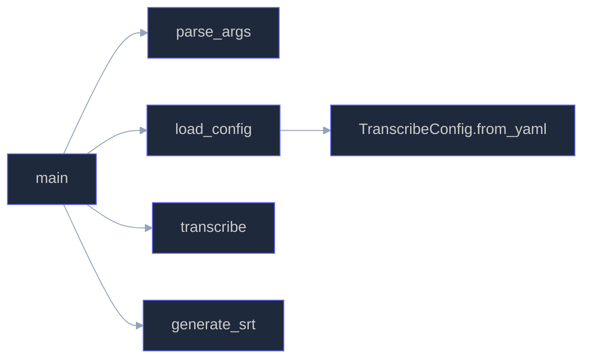
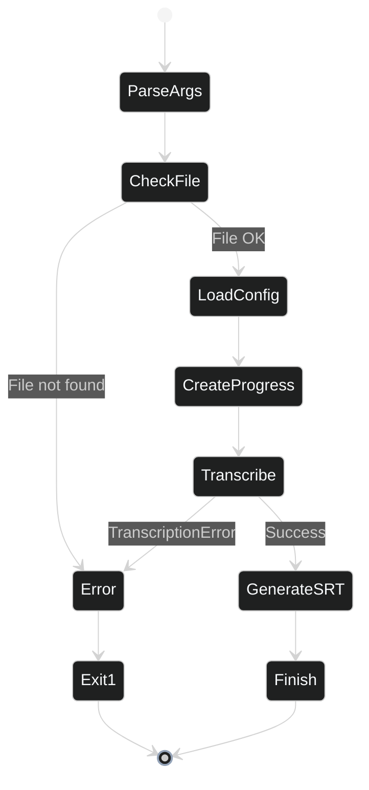
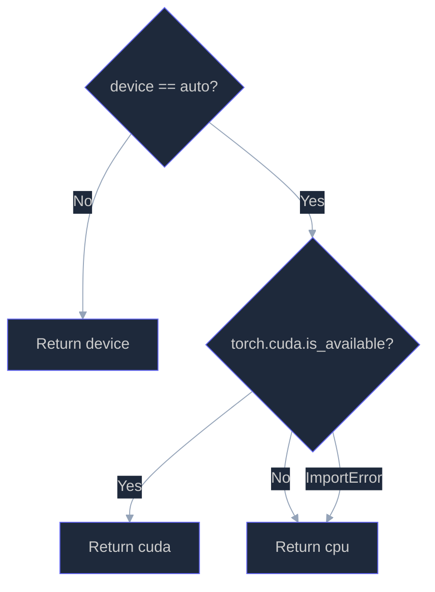
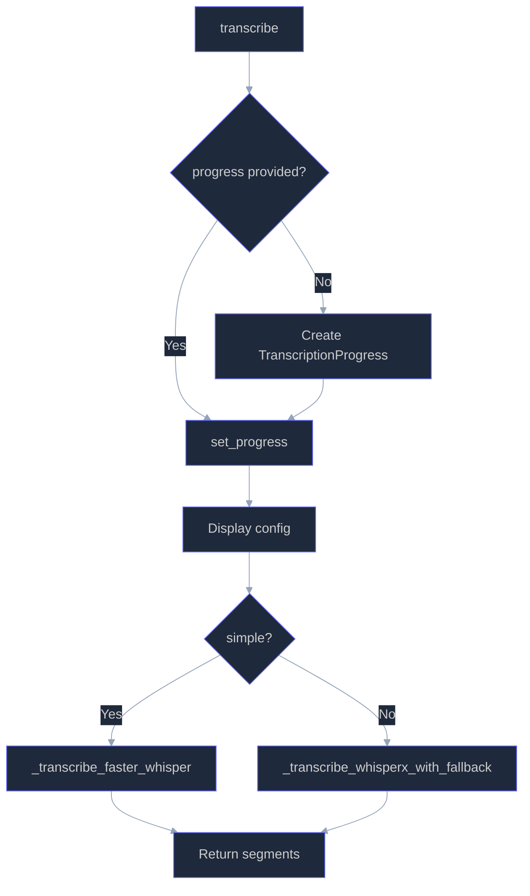
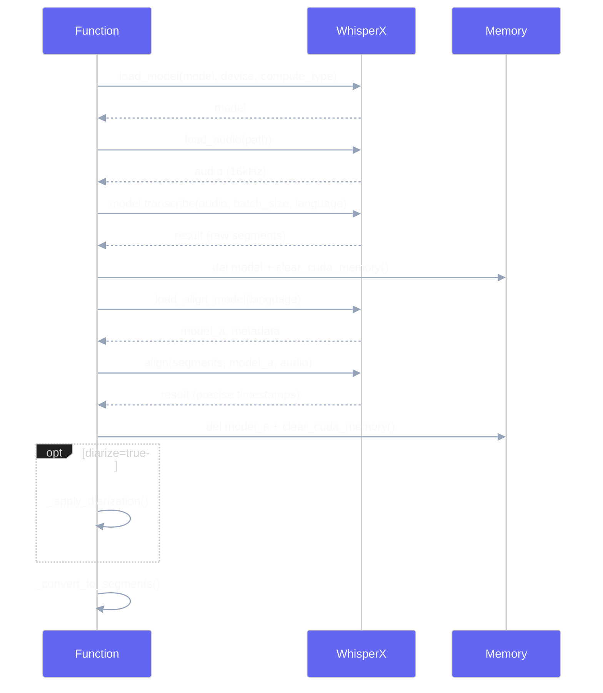
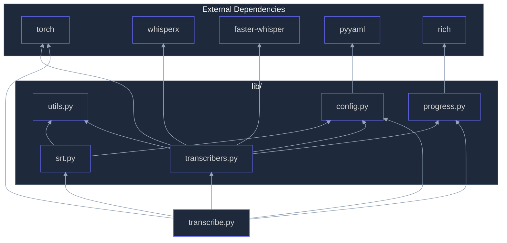

# Technical API Reference

Detailed documentation of all functions and classes in the audio/video transcription project.

---

## Table of Contents

- [transcribe.py](#transcribepy---entry-point)
- [lib/config.py](#libconfigpy---configuration)
- [lib/transcribers.py](#libtranscriberspy---transcription-engines)
- [lib/progress.py](#libprogresspy---progress-management)
- [lib/srt.py](#libsrtpy---srt-generation)
- [lib/utils.py](#libutilspy---utilities)

---

## transcribe.py - Entry Point

### Call Overview



---

### `parse_args()`

**File:** `transcribe.py:36`

**Description:**
Parses command line arguments using `argparse`.

**Signature:**
```python
def parse_args() -> argparse.Namespace
```

**Return:**
| Type | Description |
|------|-------------|
| `argparse.Namespace` | Object containing all parsed arguments |

**Supported CLI arguments:**

| Argument | Type | Default | Description |
|----------|------|---------|-------------|
| `input` | `str` | *required* | Path to audio/video file |
| `-o, --output` | `str` | `None` | Output SRT file |
| `-c, --config` | `str` | `None` | YAML configuration file |
| `-m, --model` | `str` | `None` | Whisper model (overrides config) |
| `-d, --device` | `str` | `None` | Device: `auto`, `cuda`, `cpu` |
| `--no-diarize` | `bool` | `False` | Disable diarization |
| `--hf-token` | `str` | `None` | HuggingFace token |
| `--simple` | `bool` | `False` | Simple faster-whisper mode |

---

### `load_config(args)`

**File:** `transcribe.py:77`

**Description:**
Loads configuration from a YAML file then applies command line overrides.

**Signature:**
```python
def load_config(args: argparse.Namespace) -> TranscribeConfig
```

**Parameters:**
| Name | Type | Description |
|------|------|-------------|
| `args` | `argparse.Namespace` | Arguments parsed by `parse_args()` |

**Return:**
| Type | Description |
|------|-------------|
| `TranscribeConfig` | Final configuration with overrides applied |

**Logic:**
1. Determines config file path (argument or default `config.yaml`)
2. Loads config from YAML if file exists
3. Creates default config otherwise
4. Applies CLI overrides (`model`, `device`, `no_diarize`, `hf_token`)

---

### `main()`

**File:** `transcribe.py:100`

**Description:**
Main function orchestrating the entire transcription process.

**Signature:**
```python
def main() -> None
```

**Execution flow:**



**Exceptions:**
- `sys.exit(1)` if input file doesn't exist
- `sys.exit(1)` if `TranscriptionError` is raised

---

## lib/config.py - Configuration

### Constants

```python
WHISPER_MODELS = ("tiny", "base", "small", "medium", "large-v2", "large-v3")
DEFAULT_MODEL = "large-v3"
DEFAULT_LANGUAGE = "fr"
```

---

### `class Segment`

**File:** `lib/config.py:14`

**Description:**
Dataclass representing a transcription segment.

**Attributes:**

| Name | Type | Default | Description |
|------|------|---------|-------------|
| `start` | `float` | *required* | Start timestamp (seconds) |
| `end` | `float` | *required* | End timestamp (seconds) |
| `text` | `str` | *required* | Transcribed text |
| `speaker` | `Optional[str]` | `None` | Speaker identifier |

**Methods:**

#### `to_dict()`

**Signature:**
```python
def to_dict(self) -> dict
```

**Return:**
```python
{
    "start": 0.0,
    "end": 2.5,
    "text": "Hello",
    "speaker": "SPEAKER_00"
}
```

---

### `class TranscribeConfig`

**File:** `lib/config.py:31`

**Description:**
Dataclass containing all configuration parameters for transcription.

**Attributes:**

| Name | Type | Default | Description |
|------|------|---------|-------------|
| `model` | `str` | `"large-v3"` | Whisper model to use |
| `device` | `str` | `"auto"` | Compute device |
| `language` | `str` | `"fr"` | Transcription language |
| `diarize` | `bool` | `True` | Enable diarization |
| `hf_token` | `Optional[str]` | `None` | HuggingFace token |
| `batch_size` | `int` | `16` | Batch size |
| `beam_size` | `int` | `5` | Beam size for decoding |

---

#### `get_device()`

**File:** `lib/config.py:42`

**Description:**
Determines the device to use for computation (CUDA or CPU).

**Signature:**
```python
def get_device(self) -> str
```

**Return:**
| Type | Description |
|------|-------------|
| `str` | `"cuda"` if GPU available, otherwise `"cpu"` |

**Logic:**


---

#### `get_compute_type()`

**File:** `lib/config.py:52`

**Description:**
Returns the optimal compute type based on device.

**Signature:**
```python
def get_compute_type(self) -> str
```

**Return:**
| Device | Compute Type |
|--------|--------------|
| `cuda` | `"float16"` |
| `cpu` | `"int8"` |

---

#### `from_yaml(path)` (classmethod)

**File:** `lib/config.py:56`

**Description:**
Loads configuration from a YAML file.

**Signature:**
```python
@classmethod
def from_yaml(cls, path: Union[str, Path]) -> "TranscribeConfig"
```

**Parameters:**
| Name | Type | Description |
|------|------|-------------|
| `path` | `Union[str, Path]` | Path to YAML file |

**Return:**
| Type | Description |
|------|-------------|
| `TranscribeConfig` | Configured instance |

**Example YAML file:**
```yaml
model: large-v3
device: auto
language: fr
diarize: true
hf_token: "hf_xxx"
batch_size: 16
beam_size: 5
```

---

## lib/transcribers.py - Transcription Engines

### `class TranscriptionError`

**File:** `lib/transcribers.py:11`

**Description:**
Custom exception for transcription errors.

**Inheritance:** `Exception`

---

### Constants

```python
MODEL_FALLBACK_ORDER = ["large-v3", "large-v2", "medium", "small", "base", "tiny"]
```

---

### `transcribe(audio_path, config, simple, progress)`

**File:** `lib/transcribers.py:20`

**Description:**
Main entry point for transcription. Selects appropriate engine based on options.

**Signature:**
```python
def transcribe(
    audio_path: str,
    config: TranscribeConfig,
    simple: bool = False,
    progress: Optional[TranscriptionProgress] = None
) -> List[Segment]
```

**Parameters:**
| Name | Type | Default | Description |
|------|------|---------|-------------|
| `audio_path` | `str` | *required* | Path to audio/video file |
| `config` | `TranscribeConfig` | *required* | Transcription configuration |
| `simple` | `bool` | `False` | Use faster-whisper |
| `progress` | `Optional[TranscriptionProgress]` | `None` | Progress instance |

**Return:**
| Type | Description |
|------|-------------|
| `List[Segment]` | List of transcribed segments |

**Flow:**



---

### `_transcribe_whisperx_with_fallback(audio_path, config, progress)`

**File:** `lib/transcribers.py:56`

**Description:**
Transcription with WhisperX and automatic fallback on memory errors.

**Signature:**
```python
def _transcribe_whisperx_with_fallback(
    audio_path: str,
    config: TranscribeConfig,
    progress: TranscriptionProgress
) -> List[Segment]
```

**Behavior:**
1. Attempts transcription with configured model
2. If memory error (OOM) detected:
   - Frees CUDA memory
   - Switches to lighter model
   - Retries transcription
3. Continues until success or model exhaustion

**Exceptions:**
- `TranscriptionError`: If all models fail

**OOM Detection:**
```python
is_oom = any(x in error_msg for x in [
    "out of memory", "cuda out of memory", "oom",
    "not enough memory", "allocat"
])
```

---

### `_get_next_fallback_model(current, tried)`

**File:** `lib/transcribers.py:103`

**Description:**
Finds the next lighter model to try.

**Signature:**
```python
def _get_next_fallback_model(current: str, tried: List[str]) -> Optional[str]
```

**Parameters:**
| Name | Type | Description |
|------|------|-------------|
| `current` | `str` | Current model |
| `tried` | `List[str]` | Already tried models |

**Return:**
| Type | Description |
|------|-------------|
| `Optional[str]` | Next model or `None` if none available |

---

### `_clear_cuda_memory()`

**File:** `lib/transcribers.py:116`

**Description:**
Frees GPU CUDA memory.

**Signature:**
```python
def _clear_cuda_memory() -> None
```

**Actions:**
1. `gc.collect()` - Python garbage collection
2. `torch.cuda.empty_cache()` - Empty CUDA cache
3. `torch.cuda.synchronize()` - Synchronize operations

---

### `_transcribe_whisperx(audio_path, config, progress)`

**File:** `lib/transcribers.py:129`

**Description:**
Complete transcription with WhisperX including alignment and optionally diarization.

**Signature:**
```python
def _transcribe_whisperx(
    audio_path: str,
    config: TranscribeConfig,
    progress: TranscriptionProgress
) -> List[Segment]
```

**Steps:**



**Exceptions:**
- `TranscriptionError`: If whisperx is not installed

---

### `_apply_diarization(audio, result, config, device, progress)`

**File:** `lib/transcribers.py:184`

**Description:**
Applies speaker identification to transcribed segments.

**Signature:**
```python
def _apply_diarization(
    audio,
    result: dict,
    config: TranscribeConfig,
    device: str,
    progress: TranscriptionProgress
) -> dict
```

**Parameters:**
| Name | Type | Description |
|------|------|-------------|
| `audio` | `np.ndarray` | Audio loaded by whisperx |
| `result` | `dict` | WhisperX transcription result |
| `config` | `TranscribeConfig` | Configuration |
| `device` | `str` | Compute device |
| `progress` | `TranscriptionProgress` | Progress manager |

**Return:**
| Type | Description |
|------|-------------|
| `dict` | Result enriched with speakers |

**Prerequisites:**
- Valid HuggingFace token
- Accepted pyannote terms on HuggingFace

---

### `_transcribe_faster_whisper(audio_path, config, progress)`

**File:** `lib/transcribers.py:230`

**Description:**
Simple transcription with faster-whisper without diarization.

**Signature:**
```python
def _transcribe_faster_whisper(
    audio_path: str,
    config: TranscribeConfig,
    progress: TranscriptionProgress
) -> List[Segment]
```

**Advantages:**
- Lower memory usage
- Faster
- No HuggingFace token needed

**Disadvantages:**
- No speaker identification
- Less precise timestamps

---

### `_convert_to_segments(raw_segments)`

**File:** `lib/transcribers.py:266`

**Description:**
Converts raw WhisperX segments to `Segment` objects.

**Signature:**
```python
def _convert_to_segments(raw_segments: list) -> List[Segment]
```

**Transformation:**
```python
# Input (WhisperX dict)
{"start": 0.0, "end": 2.5, "text": "Hello", "speaker": "SPEAKER_00"}

# Output (Segment object)
Segment(start=0.0, end=2.5, text="Hello", speaker="SPEAKER_00")
```

---

## lib/progress.py - Progress Management

### Constants

```python
STEPS = {
    "load_model": ("Loading model", 10),
    "load_audio": ("Loading audio", 5),
    "transcribe": ("Transcription", 40),
    "align": ("Timestamp alignment", 15),
    "diarize": ("Speaker identification", 25),
    "generate_srt": ("Generating SRT", 5),
}
```

**Structure:** `{step_name: (display_name, weight_percent)}`

---

### `class TranscriptionProgress`

**File:** `lib/progress.py:34`

**Description:**
Real-time progress display manager with Rich.

**Attributes:**

| Name | Type | Description |
|------|------|-------------|
| `show_progress` | `bool` | Show progress |
| `start_time` | `Optional[float]` | Start timestamp |
| `current_step` | `Optional[str]` | Current step |

---

#### `start(filename, config_info)`

**File:** `lib/progress.py:44`

**Description:**
Starts tracking and displays configuration information.

**Signature:**
```python
def start(self, filename: str, config_info: dict) -> None
```

**Display:**
```
╭─────────────── Configuration ───────────────╮
│  File         video.mp4                     │
│  Model        large-v3                      │
│  Device       cuda                          │
│  Language     fr                            │
│  Diarization  Yes                           │
╰─────────────────────────────────────────────╯
```

---

#### `step(step_name, message)`

**File:** `lib/progress.py:65`

**Description:**
Starts a new step.

**Signature:**
```python
def step(self, step_name: str, message: Optional[str] = None) -> None
```

**Display:**
```
→ Loading model large-v3...
```

---

#### `step_done(step_name, message)`

**File:** `lib/progress.py:78`

**Description:**
Marks a step as completed.

**Signature:**
```python
def step_done(self, step_name: str, message: Optional[str] = None) -> None
```

**Display:**
```
✓ Loading model large-v3 (12.3s)
```

---

#### `info(message)`

**File:** `lib/progress.py:90`

**Signature:**
```python
def info(self, message: str) -> None
```

**Display:** `  Duration: 5.2 minutes`

---

#### `warning(message)`

**File:** `lib/progress.py:95`

**Signature:**
```python
def warning(self, message: str) -> None
```

**Display:** `  ⚠ HuggingFace token not provided`

---

#### `error(message)`

**File:** `lib/progress.py:100`

**Signature:**
```python
def error(self, message: str) -> None
```

**Display:** `✗ Critical error`

---

#### `finish(segment_count, output_path)`

**File:** `lib/progress.py:104`

**Description:**
Displays the final summary.

**Signature:**
```python
def finish(self, segment_count: int, output_path: str) -> None
```

**Display:**
```
╭─────────────── Result ───────────────╮
│  Done!                               │
│                                      │
│  Segments:  142                      │
│  Duration:  2m 34s                   │
│  File:      output.srt               │
╰──────────────────────────────────────╯
```

---

#### `_format_elapsed()` / `_format_time(seconds)`

**File:** `lib/progress.py:121`, `lib/progress.py:128`

**Description:**
Internal time formatting functions.

**Examples:**
| Seconds | Output |
|---------|--------|
| 45.2 | `"45.2s"` |
| 125 | `"2m 5s"` |
| 3725 | `"1h 2m"` |

---

### `step_progress(progress, step_name, message)`

**File:** `lib/progress.py:141`

**Description:**
Context manager for automatic step tracking.

**Signature:**
```python
@contextmanager
def step_progress(
    progress: TranscriptionProgress,
    step_name: str,
    message: Optional[str] = None
) -> Generator
```

**Example:**
```python
with step_progress(progress, "load_model", "Loading model large-v3"):
    model = whisperx.load_model(...)
# Automatically displays "✓ ... (Xs)" at the end
```

---

### `get_progress()` / `set_progress(progress)`

**File:** `lib/progress.py:155`, `lib/progress.py:160`

**Description:**
Accessors for the global progress instance.

```python
def get_progress() -> Optional[TranscriptionProgress]
def set_progress(progress: Optional[TranscriptionProgress]) -> None
```

---

## lib/srt.py - SRT Generation

### `generate_srt(segments, output_path, include_speaker)`

**File:** `lib/srt.py:9`

**Description:**
Generates a subtitle file in SRT format.

**Signature:**
```python
def generate_srt(
    segments: List[Segment],
    output_path: str,
    include_speaker: bool = True
) -> None
```

**Parameters:**
| Name | Type | Default | Description |
|------|------|---------|-------------|
| `segments` | `List[Segment]` | *required* | Segments to write |
| `output_path` | `str` | *required* | SRT file path |
| `include_speaker` | `bool` | `True` | Include speaker name |

**Generated SRT format:**
```srt
1
00:00:00,000 --> 00:00:02,500
[SPEAKER_00] Hello everyone.

2
00:00:02,800 --> 00:00:05,200
[SPEAKER_01] How are you?
```

**Without speaker (`include_speaker=False`):**
```srt
1
00:00:00,000 --> 00:00:02,500
Hello everyone.
```

---

## lib/utils.py - Utilities

### `patch_torch_load()`

**File:** `lib/utils.py:7`

**Description:**
Compatibility function for PyTorch 2.6+ patch. The actual patch is applied in `transcribe.py`.

**Signature:**
```python
def patch_torch_load() -> None
```

**Note:** This function is empty. The patch is applied directly at `transcribe.py` startup:
```python
def _patched_torch_load(*args, **kwargs):
    kwargs["weights_only"] = False
    return _original_torch_load(*args, **kwargs)
torch.load = _patched_torch_load
```

---

### `get_hf_token(provided_token)`

**File:** `lib/utils.py:16`

**Description:**
Retrieves HuggingFace token from argument or environment variable.

**Signature:**
```python
def get_hf_token(provided_token: Optional[str] = None) -> Optional[str]
```

**Parameters:**
| Name | Type | Default | Description |
|------|------|---------|-------------|
| `provided_token` | `Optional[str]` | `None` | Explicitly provided token |

**Return:**
| Type | Description |
|------|-------------|
| `Optional[str]` | Token or `None` if unavailable |

**Priority:**
1. `provided_token` if provided
2. `HF_TOKEN` environment variable
3. `None` otherwise

---

### `format_timestamp(seconds)`

**File:** `lib/utils.py:21`

**Description:**
Converts seconds to SRT timestamp format.

**Signature:**
```python
def format_timestamp(seconds: float) -> str
```

**SRT Format:** `HH:MM:SS,mmm`

**Examples:**
| Input | Output |
|-------|--------|
| `0.0` | `"00:00:00,000"` |
| `65.5` | `"00:01:05,500"` |
| `3661.123` | `"01:01:01,123"` |

**Implementation:**
```python
hours = int(seconds // 3600)
minutes = int((seconds % 3600) // 60)
secs = int(seconds % 60)
millis = int((seconds - int(seconds)) * 1000)
return f"{hours:02d}:{minutes:02d}:{secs:02d},{millis:03d}"
```

---

## Dependency Diagram



---

## Function Index

| Function | File | Line |
|----------|------|------|
| `main()` | transcribe.py | 100 |
| `parse_args()` | transcribe.py | 36 |
| `load_config()` | transcribe.py | 77 |
| `Segment.to_dict()` | lib/config.py | 22 |
| `TranscribeConfig.get_device()` | lib/config.py | 42 |
| `TranscribeConfig.get_compute_type()` | lib/config.py | 52 |
| `TranscribeConfig.from_yaml()` | lib/config.py | 56 |
| `transcribe()` | lib/transcribers.py | 20 |
| `_transcribe_whisperx_with_fallback()` | lib/transcribers.py | 56 |
| `_get_next_fallback_model()` | lib/transcribers.py | 103 |
| `_clear_cuda_memory()` | lib/transcribers.py | 116 |
| `_transcribe_whisperx()` | lib/transcribers.py | 129 |
| `_apply_diarization()` | lib/transcribers.py | 184 |
| `_transcribe_faster_whisper()` | lib/transcribers.py | 230 |
| `_convert_to_segments()` | lib/transcribers.py | 266 |
| `TranscriptionProgress.start()` | lib/progress.py | 44 |
| `TranscriptionProgress.step()` | lib/progress.py | 65 |
| `TranscriptionProgress.step_done()` | lib/progress.py | 78 |
| `TranscriptionProgress.info()` | lib/progress.py | 90 |
| `TranscriptionProgress.warning()` | lib/progress.py | 95 |
| `TranscriptionProgress.error()` | lib/progress.py | 100 |
| `TranscriptionProgress.finish()` | lib/progress.py | 104 |
| `step_progress()` | lib/progress.py | 141 |
| `get_progress()` | lib/progress.py | 155 |
| `set_progress()` | lib/progress.py | 160 |
| `generate_srt()` | lib/srt.py | 9 |
| `patch_torch_load()` | lib/utils.py | 7 |
| `get_hf_token()` | lib/utils.py | 16 |
| `format_timestamp()` | lib/utils.py | 21 |
