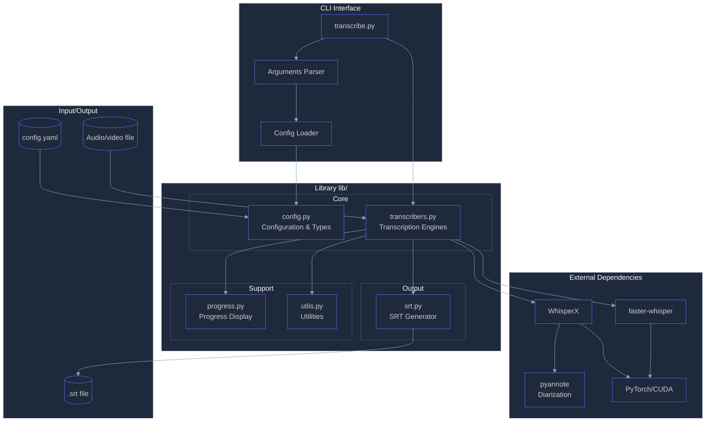
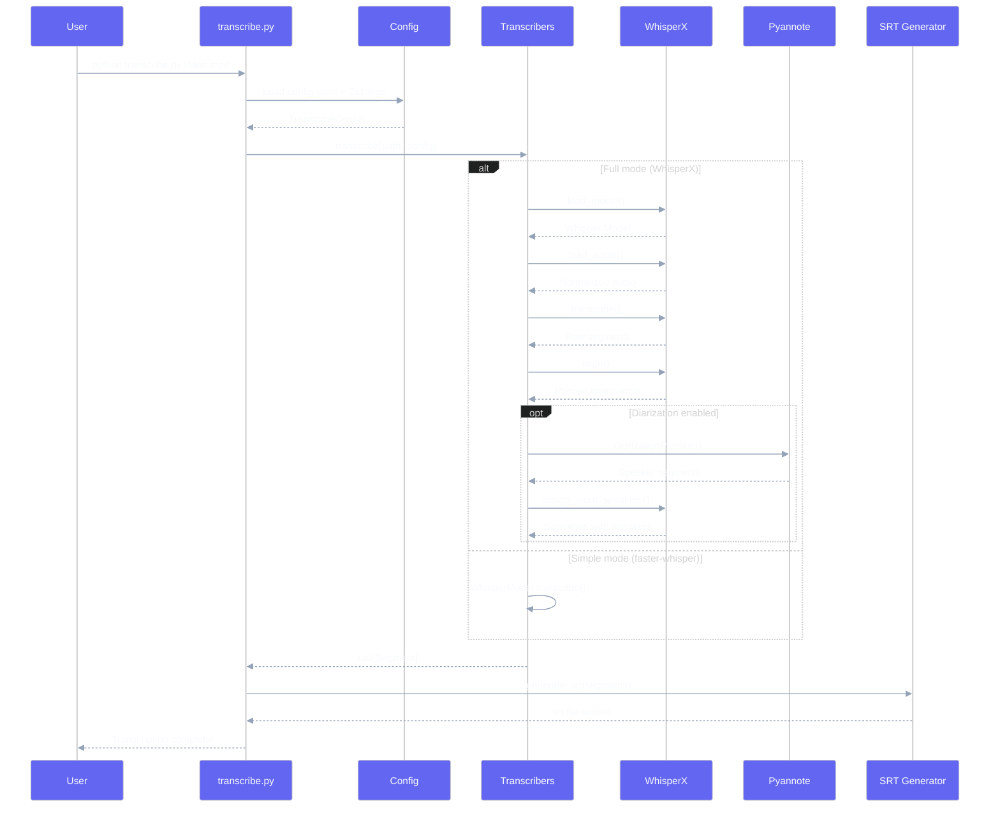
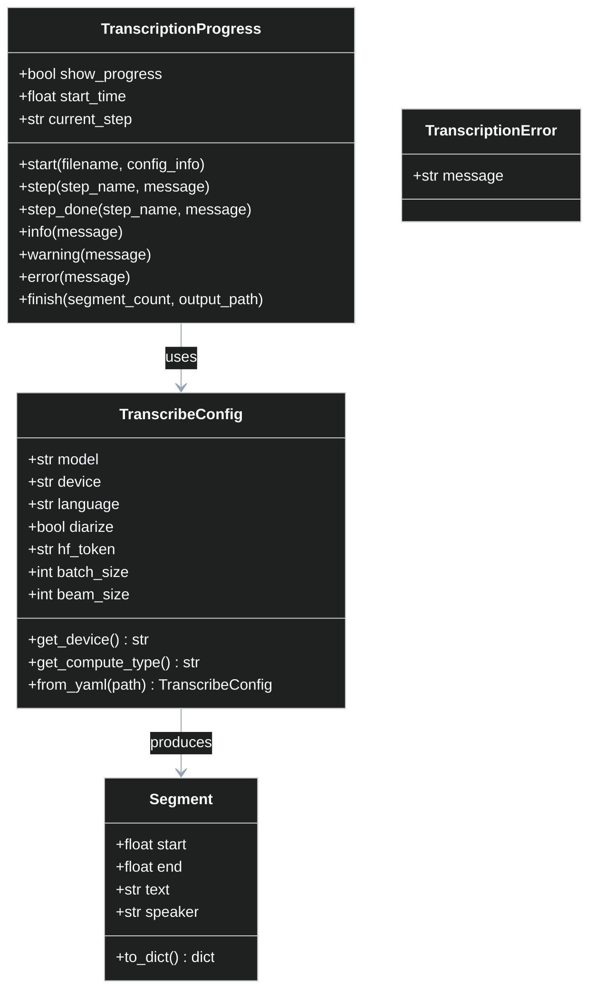
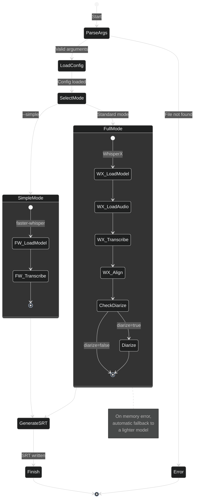
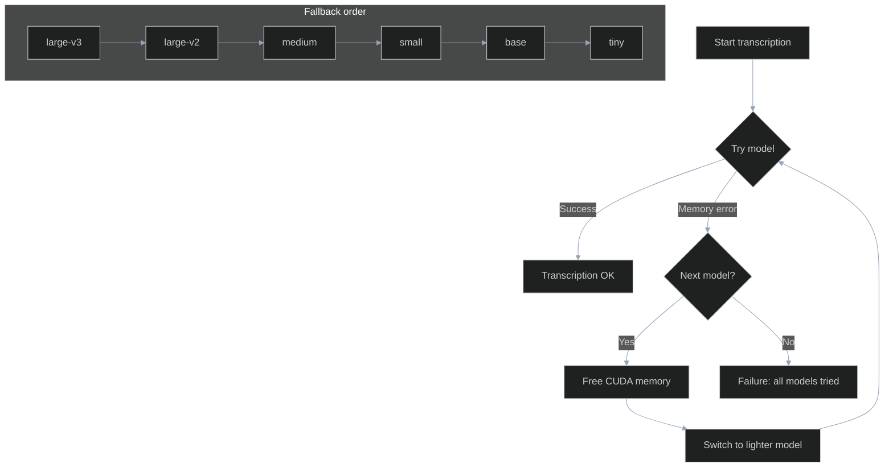

# Audio/Video Transcription - Architecture

## Overview

This project is a Python command-line tool for **transcribing audio/video files** to SRT subtitle files. It uses **Whisper** speech recognition technology and offers **speaker identification** (diarization) via **pyannote**.

### Main Features

- Automatic audio/video transcription to SRT
- Speaker identification (diarization)
- GPU (CUDA) and CPU support
- Automatic fallback to lighter models when memory is insufficient
- Configuration via YAML file or CLI arguments
- Simple mode (faster-whisper) without diarization

---

## System Architecture



---

## File Structure

```
whisper-scribe/
├── transcribe.py          # Main CLI entry point
├── config.yaml            # Default configuration
├── requirements.txt       # Python dependencies
└── lib/                   # Internal library
    ├── __init__.py        # Public module exports
    ├── config.py          # Configuration and data types
    ├── transcribers.py    # Transcription logic
    ├── progress.py        # Progress display
    ├── srt.py             # SRT file generation
    └── utils.py           # Utility functions
```

---

## Data Flow



---

## Data Model



---

## Transcription Workflow



---

## Memory Fallback Mechanism



---

## Component Descriptions

### `transcribe.py` - CLI Entry Point

Main script that orchestrates the entire process:
- Parses command line arguments
- Loads configuration (YAML + CLI overrides)
- Launches transcription
- Handles errors and displays results

**Supported arguments:**
| Argument | Description |
|----------|-------------|
| `input` | Audio/video file to transcribe |
| `-o, --output` | Output SRT file |
| `-c, --config` | YAML configuration file |
| `-m, --model` | Whisper model (tiny, base, small, medium, large-v2, large-v3) |
| `-d, --device` | Device (auto, cuda, cpu) |
| `--no-diarize` | Disable speaker identification |
| `--hf-token` | HuggingFace token for pyannote |
| `--simple` | Simple mode with faster-whisper |

### `lib/config.py` - Configuration

Defines data types and configuration management:
- `TranscribeConfig`: Transcription parameters (model, device, language, etc.)
- `Segment`: A transcription segment (start, end, text, speaker)
- Loading from YAML file

### `lib/transcribers.py` - Transcription Engines

Contains the main transcription logic:
- **Full mode (WhisperX)**: Transcription + alignment + diarization
- **Simple mode (faster-whisper)**: Basic transcription without diarization
- **Automatic fallback**: Switches to lighter models on OOM errors

### `lib/progress.py` - Progress Display

Manages real-time progress display with Rich:
- Progress steps with visual indicators
- Info, warning, error messages
- Final summary with statistics

### `lib/srt.py` - SRT Generation

Generates subtitle files in SRT format:
- Timestamp formatting (HH:MM:SS,mmm)
- Optional speaker name inclusion

### `lib/utils.py` - Utilities

Various helper functions:
- HuggingFace token retrieval
- Timestamp formatting

---

## Configuration (config.yaml)

```yaml
# Whisper model
model: large-v3        # tiny, base, small, medium, large-v2, large-v3

# Compute device
device: auto           # auto, cuda, cpu

# Transcription language
language: fr

# Speaker identification
diarize: true

# HuggingFace token (required for diarization)
hf_token: "hf_xxx..."

# Advanced parameters
batch_size: 16
beam_size: 5
```

---

## External Dependencies

| Package | Role |
|---------|------|
| `torch` | Deep learning framework, CUDA support |
| `whisperx` | Transcription with alignment and diarization |
| `faster-whisper` | Lightweight alternative for simple transcription |
| `pyannote` | Speaker identification (via whisperx) |
| `pyyaml` | Configuration file reading |
| `rich` | Enhanced console display |

---

## Usage Examples

```bash
# Standard transcription with diarization
python transcribe.py "video.mp4"

# Specify output file
python transcribe.py "video.mp4" --output "subtitles.srt"

# Use a lighter model
python transcribe.py "video.mp4" --model medium

# Simple mode (faster, without diarization)
python transcribe.py "video.mp4" --simple

# Disable diarization
python transcribe.py "video.mp4" --no-diarize

# Force CPU usage
python transcribe.py "video.mp4" --device cpu
```
